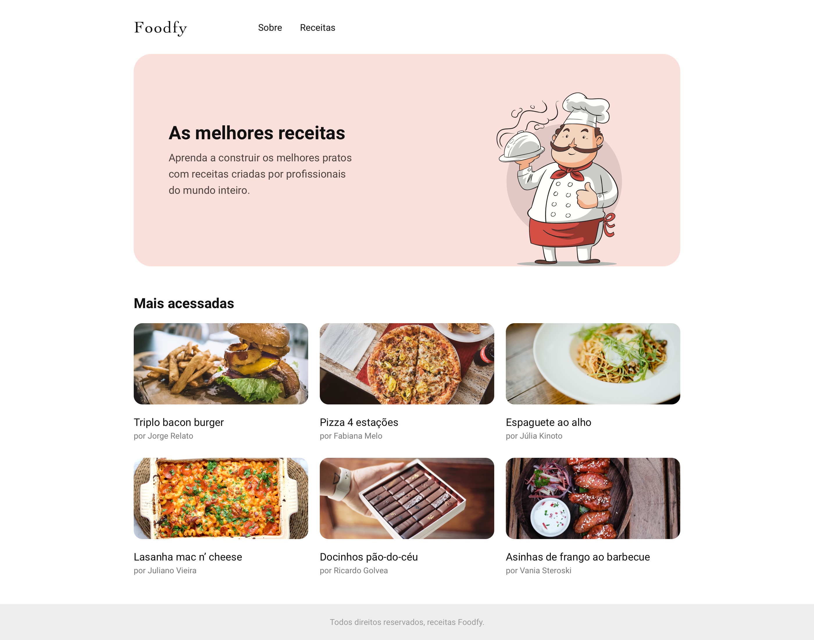

<h1 align="center">
    
</h1>

<h2 align="center">
  Construção do site Foodfy
</h2>

<blockquote align="center">“Sua única limitação é você mesmo”!</blockquote>

  

  

## 🗄 Tecnologias

- :u6708: **Javascript**
- :u7533: **HTML5**
- :u6709: **CSS**

## 🚀 Desafios

Construção de um site completo para uma empresa (fictícia) de receitas chamada Foodfy.

## 📅 Entrega

Sem data definida

## 📝 Licença

Esse projeto está sob a licença MIT. Veja o arquivo [LICENSE](LICENSE.md) para mais detalhes.